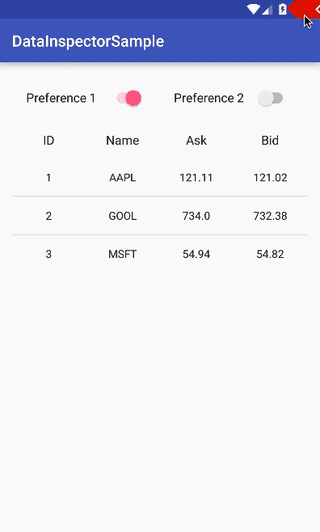

Data Inspector Plugin
=====================

[  ](https://bintray.com/xfumihiro/maven/DataInspector/_latestVersion)

Data inspection toolbar for android development.



Features
--------

- Edit Preferences

- Edit Databases

- Show Storage Usage

- Logging
  - show Preference events in logcat
  - show Storage events in logcat

- Absolute ZERO effects on non-debug builds

Usage
-----

```groovy
buildscript {
  repositories {
    jcenter() // or mavenCentral()
  }

  dependencies {
    classpath 'com.github.xfumihiro.data-inspector:data-inspector-plugin:0.1.0'
  }
}

apply plugin: 'com.android.application'
apply plugin: 'data-inspector'
```


Snapshots of the development version are available in [Sonatype's `snapshots` repository][snap].


Developed by
------------
Fumihiro Xue
 * [@xfumihiro](https://twitter.com/xfumihiro)
 * [+xfumihiro](https://plus.google.com/u/0/107636471060158273635)

License
-------

    Copyright 2015 Fumihiro Xue

    Licensed under the Apache License, Version 2.0 (the "License");
    you may not use this file except in compliance with the License.
    You may obtain a copy of the License at

       http://www.apache.org/licenses/LICENSE-2.0

    Unless required by applicable law or agreed to in writing, software
    distributed under the License is distributed on an "AS IS" BASIS,
    WITHOUT WARRANTIES OR CONDITIONS OF ANY KIND, either express or implied.
    See the License for the specific language governing permissions and
    limitations under the License.

[snap]: https://oss.sonatype.org/content/repositories/snapshots/